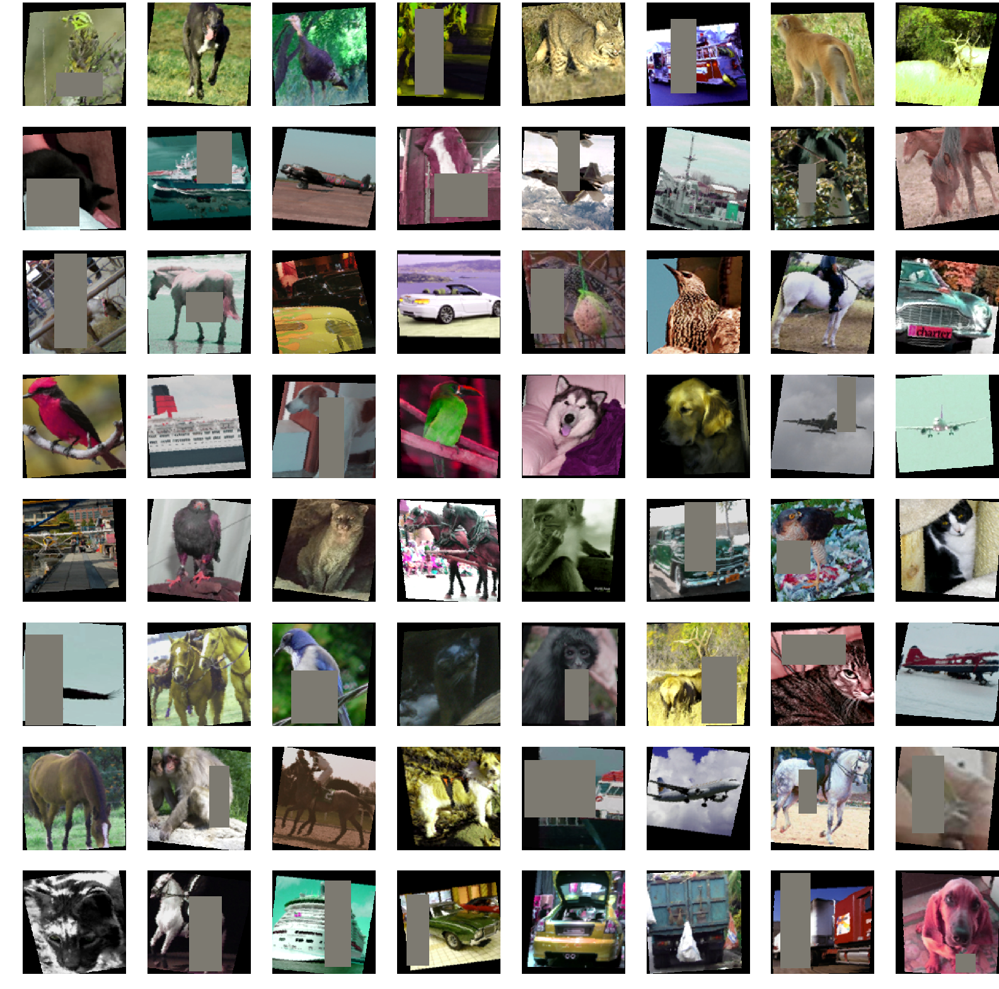

# Style Augmentation
This code is an implementation of the paper [Style Augmentation: Data Augmentation via Style Randomization
](https://arxiv.org/abs/1809.05375). My main contributions here are the following:

- We used Xception and InceptionV4 as classifier networks.
- We used [Learning Linear Transformations for Fast Image and Video Style Transfer](https://github.com/sunshineatnoon/LinearStyleTransfer) as stylizing network.
- We trained the styliying net using the r31 and saving the embedded features in the same manner as the original style tranfer paper (however, pretrained methods are available for the stylizing network.


## Personal Targets
- Understand the influence between stylization in augmentation and networks that perform this task (I tested and read several style transfer, but this one was the best).
- Train networks and use a network as data augmenter embedded in torchvision.
- Understand the incluence of data augmentation in each network and hyperparameter fitting
- Analyze the noise in the latent domain (uniform and gaussian were tested).

## Usage
All parameters are detailed in `main.py` and `config_classification.py`, just download the pretrained model for stylization from [original authors](https://drive.google.com/file/d/1H9T5rfXGlGCUh04DGkpkMFbVnmscJAbs/view) or you can follow the author's procedure to get the model, thereafter move the model into models folder. Finally, run the training code.:


```
python training.py
```
hyperparameters can be edited in the `config_classification.py`

### Results

Results reported on Xception and InceptionV4 using STL-10 for classfication task are the following: 

| Netwrok    |    Trad   |   Style   |  Accuracy  | 
| ---------  | --------- | --------- | ---------- |
| Xception   |           |           |   68.17%   |
| Xception   |     X     |           |   83.60%   |
| Xception   |           |     X     |   69.27%   |
| Xception   |     X     |     X     |      -     |
| InceptionV4|           |           |   73.54%   |
| InceptionV4|     X     |           |   86.06%   |
| InceptionV4|           |     X     |   75.69%   |
| InceptionV4|     X     |     X     |      -     |

Some qualitative results for style transfer.





